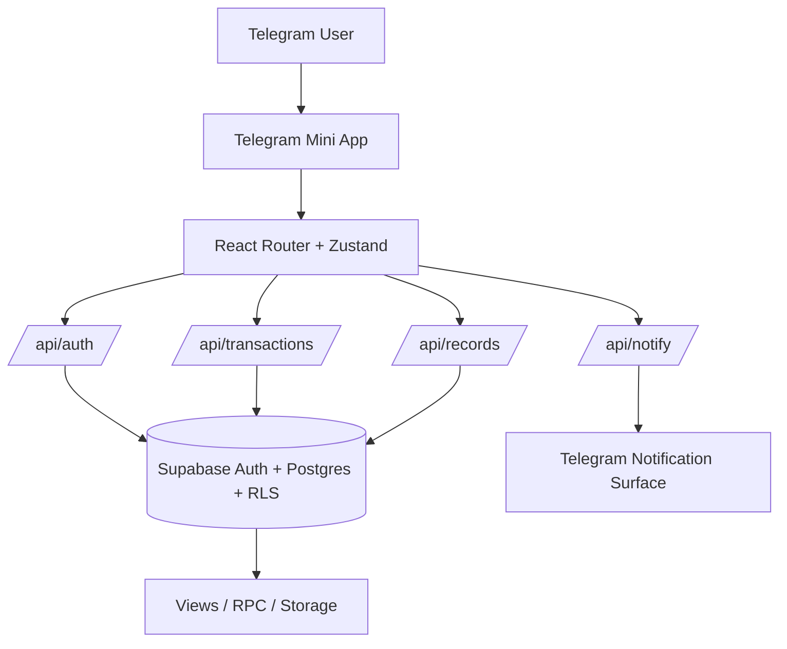
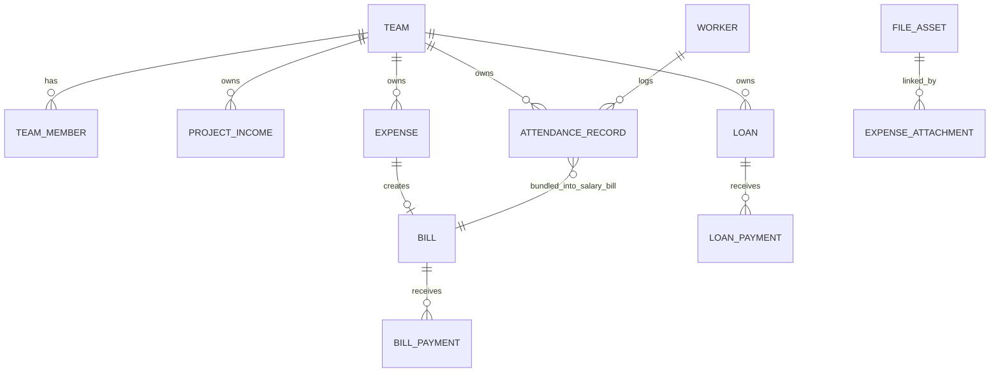

# PRD — Banplex Greenfield

Baseline date: `2026-04-18`  
Status: `final baseline draft`  
Source basis: repo reality plus `docs/hand-off/app-flow-core-feature-architecture-audit.md` and existing release-planning docs in `docs/`

Dokumen ini menjadi baseline produk resmi yang merapikan handoff audit menjadi satu PRD master. Audit detail, ambiguity, brainstorming, dan backlog tetap dipertahankan di bagian appendix dokumen ini.

## 1. Overview

Banplex Greenfield adalah `Telegram Mini App` untuk operator proyek yang perlu mencatat arus kas, tagihan, pembayaran, absensi, payroll, dan data referensi kerja dari perangkat mobile. Produk ini ditujukan terutama untuk `Owner`, `Admin`, dan operator domain seperti `Payroll` atau `Logistik` yang bekerja di dalam workspace tim yang sama. Tujuan utamanya adalah menyediakan satu workspace operasional harian yang auditable, mobile-first, dan cukup sederhana untuk dipakai tanpa model akuntansi yang berat. Postur produk saat ini adalah `late integration-stage operational workspace`: fitur inti sudah nyata di repo, tetapi baseline release belum aman sebelum source of truth, lifecycle, dan boundary API dibakukan.

## 2. Requirements

| Area | Requirement resmi |
| --- | --- |
| Platform & access | Entrypoint resmi adalah Telegram WebApp dengan validasi `initData`; browser di luar Telegram hanya dianggap fallback dev/reviewer sampai ada keputusan produk lain. |
| User & role | Workspace memakai model `team` dengan role minimum `Owner`, `Admin`, `Payroll`, `Logistik`, `Administrasi`, dan `Viewer`; `Owner`/`Admin` adalah operator utama untuk CRUD sensitif. |
| Data ownership | Semua record bisnis inti wajib terikat ke `team_id`, tunduk pada membership + RLS, dan menyimpan actor/timestamp yang cukup untuk audit operasional. |
| Source of truth principle | Domain inti resmi adalah model relasional `project_incomes`, `expenses`, `bills`, `bill_payments`, `loans`, `loan_payments`, `attendance_records`, dan read model SQL terkait; `transactions` diperlakukan sebagai legacy compatibility layer, bukan jalur create baru. |
| API boundary | Auth selalu lewat `/api/auth`; write untuk finance, payment, attendance, payroll, recycle bin, dan reporting final harus berada di boundary API/RPC yang tegas; direct Supabase client pada domain inti dianggap debt transisi, bukan kontrak final. |
| Manual vs automation | User memasukkan fakta bisnis secara manual; sistem boleh mengotomasi bill child, status unpaid/partial/paid, remaining balance, salary bill generation, dan read model selama aturannya tertulis dan auditable. |
| Notification & output | Telegram adalah surface identity dan notifikasi; notifikasi/PDF dari bot hanya side effect dan tidak pernah menjadi source of truth bisnis; user-facing export berada di luar core release sampai diputuskan tegas. |
| Mobile-first | Semua flow inti harus usable di layar Telegram mobile dengan safe area, bottom navigation, full-screen routed form, dan list yang tetap ringan saat data bertambah. |

## 3. Core Features

### Release Core

- Telegram auth, workspace gating, dan role-aware access.
- Dashboard operasional sebagai overview dan launch surface.
- Workspace ledger di `/transactions` sebagai aktivitas operasional utama.
- Project income beserta child bill yang relevan.
- Expense operasional beserta bill, payment, attachment, dan recycle bin dasar.
- Material invoice / `surat_jalan` dalam domain expense material.
- Loan dan loan payment.
- Payment workspace untuk bill dan loan dengan partial payment.
- Attendance journal, payroll manager, dan salary bill.
- Master data yang dibutuhkan oleh flow inti: proyek, supplier, pekerja, material, kategori, staff, profession, creditor.
- Soft delete, restore, dan recycle bin untuk domain inti.

### Supporting

- Team invite dan role management.
- Project financial reporting.
- Attachment pipeline berbasis `file_assets`.
- Beneficiaries.
- HRD applicants dan dokumen HRD.
- `More` sebagai hub modul pendukung yang belum diberi IA final.

### Deferred / Not in Release Core

- User-facing PDF suite dan settings UI PDF yang lengkap.
- Formal `void` / `reversal` accounting semantics.
- Browser-first auth sebagai flow produk resmi.
- Offline-first / PWA scope.
- Realtime collaboration penuh.
- Ekspansi HRD, beneficiary, atau admin console yang tidak memblokir flow inti.

## 4. User Flow

### Entry / Auth

1. User membuka Mini App dari Telegram.
2. App memanggil `tg.ready()` / `tg.expand()`, lalu mengirim `initData` dan `startParam` ke `/api/auth`.
3. Server memverifikasi Telegram identity, membership tim, dan invite token bila ada.
4. User yang valid masuk ke workspace; user tanpa membership aktif berhenti di access-denied screen.

`Needs final product decision`: apakah browser-only access akan pernah didukung sebagai flow resmi selain fallback dev/reviewer.

### Dashboard / Workspace

- `/` adalah overview, bukan ledger utama.
- Dashboard memuat summary, unpaid bills, active loans, project summary, dan quick action ke form utama.
- Dashboard diposisikan sebagai control panel dan shortcut kerja, bukan satu-satunya histori aktivitas.

`Needs final product decision`: apakah recent activity dashboard harus menjadi subset ketat dari ledger resmi atau boleh tetap berupa curated overview.

### Ledger / Detail

- `/transactions` adalah workspace histori operasional baseline.
- User membuka detail record dari ledger untuk melihat parent-child state, histori pembayaran, attachment, dan action yang relevan.
- Detail page adalah tempat audit dan context; routed form tetap menjadi tempat edit/create utama.

### Create / Edit / Pay

- Create dan edit record inti memakai routed full-screen form: project income, expense, material invoice, loan, dan attendance.
- Payment selalu berjalan lewat `/payment/:id` atau `/loan-payment/:id`; partial payment adalah flow resmi.
- Parent record dikunci atau dibatasi edit-nya ketika child payment atau salary bill sudah ada sesuai lifecycle domain.

### Attendance / Payroll

1. Admin atau Payroll mencatat jurnal absensi harian per tanggal dan proyek.
2. Record `unbilled` dapat diedit atau dihapus sesuai guard role.
3. Payroll manager membundel attendance menjadi salary bill lewat RPC.
4. Salary bill lalu mengikuti lifecycle bill yang sama: daftar tagihan, payment history, delete/restore, dan report.

`Needs final product decision`: UI final untuk `batalkan rekap gaji` setelah salary bill sudah pernah dibuat, walaupun policy dasarnya sudah jelas.

### Admin / Reference

- `/master` memegang master data kerja.
- `/more` memegang modul pendukung seperti payroll route, team invite, HRD, dan beneficiaries.
- Modul pendukung tidak boleh mengubah kontrak release core tanpa keputusan produk eksplisit.

### Fallback / Edge Flow

- Delete default berarti `archive` / `soft delete`, lalu entity masuk recycle bin.
- Restore wajib memulihkan tree parent-child yang sama.
- Permanent delete hanya boleh dari recycle bin dan role-gated.
- Hapus payment saat ini berarti mengarsipkan child payment; itu bukan reversal accounting.

`Needs final product decision`: apakah material invoice dan `surat_jalan` akan dipertahankan sebagai satu domain dengan mode berbeda atau dipisah menjadi kontrak dokumen yang lebih keras.

## 5. Architecture

### Telegram / Web role

- Telegram adalah launch surface, identity surface, dan notification surface.
- Browser non-Telegram bukan target produk utama pada baseline ini.

### Frontend

- `Vite + React + BrowserRouter` untuk app shell dan routed workspace.
- `Zustand` untuk orchestration per domain.
- `Tailwind + CSS variables + Telegram theme fallback` untuk mobile-first UI.

### Backend / API

- `/api/auth` memverifikasi Telegram session dan workspace access.
- `/api/transactions` menangani ledger, summary, project income, loan, dan recycle-bin transaction-like domain.
- `/api/records` menangani expense, bills, bill payments, attendance, reports, attachments, dan material invoice.
- `/api/notify` hanya menjalankan side effect notifikasi.

### Supabase

- PostgreSQL relasional dengan RLS, views, triggers, RPC, dan storage.
- Read model penting saat ini mencakup `vw_cash_mutation`, `vw_transaction_summary`, dan `vw_project_financial_summary`.
- Boundary final menargetkan write inti berada di API/RPC, bukan direct client write acak.

### Notification / Output

- Telegram bot notification dan PDF/text output hanya side effect.
- Report dan export resmi harus membaca source data yang sama dengan ledger/payment final.

## 6. Data Model / Database Schema

### Core entities

| Domain | Entitas inti | Catatan PRD |
| --- | --- | --- |
| Workspace & access | `profiles`, `teams`, `team_members`, `invite_tokens` | semua akses produk berputar di membership tim |
| Finance | `project_incomes`, `expenses`, `expense_line_items`, `bills`, `bill_payments`, `loans`, `loan_payments` | domain inti release |
| Operations | `workers`, `worker_wage_rates`, `attendance_records` | attendance menjadi sumber salary bill |
| Reference | `projects`, `suppliers`, `expense_categories`, `funding_creditors`, `materials`, `professions`, `staff` | mendukung create/edit domain inti |
| File relations | `file_assets`, `expense_attachments` | attachment harus memakai relation table |
| Legacy compatibility | `transactions` | masih ada di repo/read model, tetapi bukan target write path baru |

### Important relations

- `project_incomes` dapat memiliki child bill yang relevan untuk fee / receivable tracking sesuai kontrak domain.
- `expenses` memegang konteks dokumen pengeluaran; `bills` memegang lifecycle hutang; `bill_payments` memegang histori pembayaran.
- `loans` memegang principal dan metadata pinjaman; `loan_payments` memegang histori pelunasan.
- `attendance_records` adalah jurnal kerja; salary bill dibentuk dari kumpulan attendance dan lalu masuk ke lifecycle `bill`.
- `file_assets` adalah parent file fisik; relation table menentukan file dipakai oleh domain apa.

### Parent / child lifecycle

- `bill.status` adalah pemilik lifecycle `unpaid -> partial -> paid`; parent expense atau salary context tidak boleh punya status yang bertentangan.
- Delete parent harus mengikuti tree yang konsisten ke child payment atau attachment.
- Restore parent harus memulihkan child tree yang sama.
- `attendance_records` berubah dari editable ke read-only saat sudah `billed`.
- `transactions` tidak boleh menerima flow baru yang membuat lifecycle domain relasional menjadi ambigu.

## 7. Design & Technical Constraints

### Official rules

1. Mobile-first adalah constraint produk, bukan preferensi UI.
2. Telegram Mini App adalah shell resmi; semua flow inti harus aman terhadap safe area, bottom nav, dan full-screen form behavior.
3. Role dan tenant boundary tidak boleh diakali di client; `team_id`, membership, dan RLS adalah boundary resmi.
4. Dashboard adalah overview; ledger adalah workspace histori utama.
5. `transactions` adalah compatibility layer legacy; flow baru tidak boleh diarahkan ke sana.
6. Bill adalah pemilik lifecycle pembayaran; payment history tidak boleh hidup di surface lain yang bertentangan.
7. Notifikasi Telegram, PDF notifikasi, atau cache client bukan source of truth bisnis.

### API boundary constraints

- `/api/auth` wajib menjadi boundary auth resmi.
- Write untuk finance, payment, attendance, payroll, recycle bin, dan reporting release final harus berada di API/RPC.
- Direct Supabase write yang masih ada di repo pada domain inti dicatat sebagai transisi yang harus dipersempit, bukan pola untuk fitur baru.
- Direct Supabase client hanya boleh dipertahankan sementara pada modul supporting yang memang sudah terdokumentasi sampai ada task boundary simplification.

### Lifecycle vocabulary

| Istilah | Arti resmi |
| --- | --- |
| `archive` / `soft delete` | record atau tree dipindahkan dari data aktif, tetap ada untuk audit dan recycle bin |
| `restore` | record atau tree diaktifkan kembali dari recycle bin |
| `permanent delete` | purge irreversible yang hanya boleh dari recycle bin dengan guard role dan parent-child yang jelas |
| `reversal` | aksi akuntansi kompensasi yang menghasilkan jejak bisnis baru; ini bukan delete dan belum masuk release core |

### What must not be ambiguous

- sumber angka saldo dashboard,
- status resmi `bill`, `payment`, `loan`, `attendance`, dan `salary bill`,
- boundary `dashboard` vs `ledger`,
- domain mana yang wajib lewat API vs yang masih sementara direct client,
- arti `delete`, `archive`, `restore`, `permanent delete`, dan `reversal`.

### What must not be done in future implementation tasks

- menambah flow inti baru ke `transactions`,
- menyamarkan direct DB write pada domain inti seolah sudah menjadi boundary final,
- mencampur UI polish besar dengan perubahan lifecycle/source-of-truth,
- mengubah supporting module menjadi blocker release tanpa keputusan produk,
- memperkenalkan `reversal` lewat tombol hapus tanpa desain kontrak audit yang jelas.

## 8. Open Product Decisions

| Area | Baseline saat ini | Keputusan yang masih dibutuhkan |
| --- | --- | --- |
| Browser access | fallback dev/reviewer saja | apakah browser-only access akan didukung resmi |
| Dashboard recent activity | overview komposit, bukan canonical ledger | apakah harus menjadi subset ketat dari ledger |
| Material invoice vs `surat_jalan` | satu domain expense material dengan mode dokumen berbeda | apakah perlu dipisah menjadi kontrak bisnis terpisah |
| Payment deletion beyond archive | archive/restore dipakai untuk release core | kapan dan bagaimana `void/reversal` resmi diperkenalkan |
| User-facing PDF scope | notifikasi Telegram ada, PDF bisnis belum final | dokumen pertama apa yang wajib dirilis dan siapa owner produknya |
| Supporting module exposure | HRD/beneficiary ada di repo tetapi bukan gate release core | apakah modul ini tampil di release awal atau disembunyikan sampai fase berikutnya |

## 9. Repo Reality Check

- Repo aktif sudah berupa `React + Zustand + Supabase + Vercel Functions`, bukan arsitektur hybrid lama.
- Route tree nyata sudah mencakup dashboard, ledger, detail, payment, attendance, payroll, master, projects, dan supporting modules.
- Finance dan attendance sudah usable, tetapi boundary write masih hybrid antara API dan direct Supabase di beberapa store.
- Read model penting sudah ada, tetapi dashboard feed dan ledger belum sepenuhnya satu model final.
- Surface legacy yang berpotensi menyesatkan masih ada dan harus diperlakukan sebagai non-baseline sampai dibersihkan.
- Postur repo yang paling akurat tetap: operasional dan kaya fitur, tetapi belum release-safe tanpa kontrak data/lifecycle yang lebih keras.

## 10. Brainstorming Questions

- **Release success**: apa definisi lulus release inti yang benar-benar bisa diuji dari UI tanpa SQL manual?
- **Workspace ergonomics**: apakah role tertentu lebih efektif masuk ke dashboard overview atau langsung ke ledger/form cepat?
- **Data truth**: apakah recent activity dashboard harus mewakili ledger resmi atau cukup menjadi feed operasional yang dikurasi?
- **Attendance correction**: bagaimana UX terbaik untuk `batalkan rekap gaji` ketika salary bill sudah pernah dibayar sebagian?
- **Output strategy**: dokumen bisnis pertama apa yang paling penting untuk user-facing export: laporan proyek, bukti bayar, invoice, atau salary recap?
- **Role exposure**: modul supporting mana yang harus tetap terlihat untuk `Payroll`, `Logistik`, dan `Viewer` pada release pertama?
- **External surface**: selain notifikasi Telegram, apakah share/download ke luar Telegram wajib untuk release awal?
- **Non-goals**: ekspektasi apa yang harus ditolak eksplisit agar scope tidak bergeser ke full accounting, offline-first, atau generic web dashboard?

## 11. Recommended Phase Order

| Phase | Fokus | Hasil yang diharapkan |
| --- | --- | --- |
| `P0` | Release contract reset | source-of-truth matrix, role `transactions`, boundary module |
| `P1` | Ledger and summary truth | saldo, dashboard, dan ledger membaca model keuangan final yang sama |
| `P2` | Lifecycle hardening core domains | create/edit/delete/restore/pay untuk income, expense, material invoice, loan, attendance, salary bill |
| `P3` | Boundary simplification | write domain inti tidak lagi hybrid tanpa alasan |
| `P4` | Output layer | attachment tree, reporting scope, PDF boundary |
| `P5` | Legacy surface cleanup | AI-safe repo boundary dan pengurangan misread trap |

## 12. Micro Task Backlog

| ID | Micro task | Outcome minimum |
| --- | --- | --- |
| `MT-01` | Lock source-of-truth matrix | satu matriks final `route -> store -> API -> table/view` untuk semua domain inti |
| `MT-02` | Finalize `transactions` boundary | keputusan eksplisit bahwa `transactions` adalah compatibility layer, plus dampaknya ke create/summary/ledger |
| `MT-03` | Align dashboard summary and ledger | satu jawaban resmi untuk asal angka saldo dan coverage histori |
| `MT-04` | Freeze core lifecycle matrix | definisi create/edit/delete/restore/pay untuk income, expense, material invoice, loan, bill, payment, attendance, salary bill |
| `MT-05` | Harden expense / bill / payment ownership | rule status, delete tree, dan payment visibility tidak ambigu |
| `MT-06` | Unify loan and loan-payment write path | loan domain tidak lagi memakai strategi write yang saling bertentangan |
| `MT-07` | Finalize attendance correction flow | flow resmi untuk koreksi attendance setelah `billed` |
| `MT-08` | Standardize attachment tree semantics | orphan cleanup, soft delete, restore, dan permission attachment seragam |
| `MT-09` | Lock reporting and PDF boundary | report inti dan PDF pertama diputuskan tanpa membuka scope liar |
| `MT-10` | Clarify supporting modules and legacy traps | status `supporting/deferred` jelas, surface legacy ditandai resmi |

## 13. Appendix Notes

### A. Audit notes retained from handoff

- Dashboard saat ini masih menyusun recent activity dari beberapa sumber client-side; itu sebabnya dashboard tidak boleh diperlakukan sebagai ledger resmi sebelum alignment selesai.
- `usePaymentStore` masih menunjukkan repo reality bahwa create payment pernah direct ke Supabase sementara update/delete sudah lewat API; ini adalah evidence hybrid boundary, bukan kontrak target.
- `useTransactionStore` masih punya jalur legacy yang menyentuh `transactions`; hal ini menjelaskan kenapa PRD ini menempatkan `transactions` sebagai compatibility layer yang harus dibatasi.
- Payroll sudah cukup matang untuk jurnal harian dan bundling salary bill, tetapi correction flow pasca billing masih perlu keputusan UX final.

### B. Legacy / AI misread traps

- `src/pages/HomePage.jsx`
- `src/components/PaymentModal.jsx`
- `src/components/TransactionForm.jsx`
- `src/store/useAppStore.js`

File di atas tidak boleh diasumsikan sebagai surface aktif untuk feature work baru tanpa verifikasi ulang.

### C. Evidence anchors

- Route tree utama: `src/App.jsx`
- Payment boundary reality: `src/store/usePaymentStore.js`
- Legacy transaction path: `src/store/useTransactionStore.js`
- Auth boundary: `api/auth.js`
- Ledger / summary boundary: `api/transactions.js`
- Expense / bill / attendance / report boundary: `api/records.js`
- Relational contract: `supabase/migrations/*`

### D. Working glossary

- `Dashboard`: overview operasional dan quick actions.
- `Ledger`: histori aktivitas kerja utama di `/transactions`.
- `Bill list`: daftar kewajiban aktif yang belum lunas.
- `Payment workspace`: halaman histori dan aksi pembayaran per bill atau loan.
- `Recycle bin`: tempat `archive` sebelum `restore` atau `permanent delete`.
