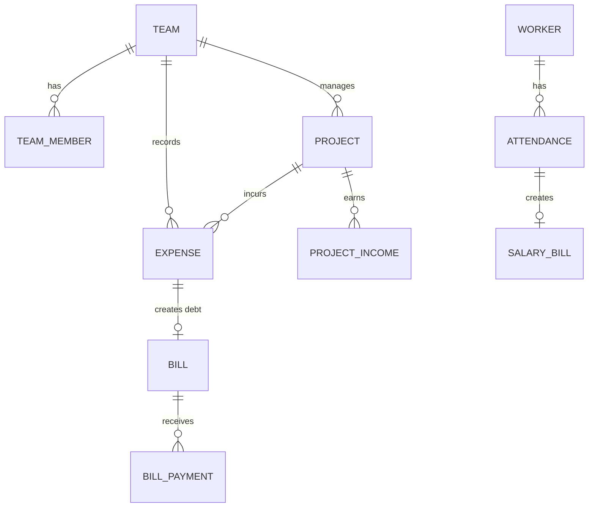

# PRD — Banplex Greenfield

## 1. Overview
Aplikasi Banplex Greenfield adalah sistem pencatatan keuangan dan operasional proyek berbasis mobile.
- **Masalah Utama**: Sulitnya pencatatan dan pelacakan kas proyek, tagihan material, absensi pekerja, serta utang/piutang secara *real-time* di lapangan bagi kontraktor atau manajemen operasional.
- **User Utama**: Operator lapangan, mandor, admin logistik, atau staf HR/Keuangan proyek yang mobilitasnya tinggi.
- **Tujuan Utama**: Menjadi instrumen *"single pane of glass"* untuk pencatatan operasi harian (mutasi kas, gaji, material) yang bebas dari jargon akuntansi teknis, mudah digunakan, dan menyajikan laporan laba/rugi seketika.
- **Konteks Platform**: Telegram Mini Web App (berjalan langsung di dalam klien Telegram). Membutuhkan UI yang responsif, *Native-feel* dengan *glassmorphism*, dan patuh pada desain *mobile-first* / batasan area layar (safe-areas).
- **Batasan Level Produk Saat Ini**: Berada pada fase **Integration Readiness**. API Backend, Skema Database Supabase, dan struktur UI (Zustand stores, router) sebagian besar telah terintegrasi untuk fungsi CRUD dasar. Transisi dari state vanilla ke React murni masih berlangsung, memerlukan stabilisasi alur data *source of truth* sebelum *visual polish* final.

## 2. Requirements
- **Akses & Platform**: Pintu masuk 100% bergantung pada Telegram WebApp SDK. Tidak ada form registrasi mandiri di luar sesi Telegram tervalidasi (`initData`).
- **Tipe User / Role**: Akses berbasis *Team* (Workspace). Autentikasi mengandalkan validasi hash Telegram, yang kemudian memetakan user ke `team_members` di database.
- **Input Model**: Mengandalkan antarmuka "Zero Jargon" ("Pemasukan", "Pengeluaran" bukan "Kredit/Debit"). Formulir dibuat ringkas per domin kerja (Form Pekerja, Form Pengeluaran, Form Pinjaman).
- **Source of Truth**: Database PostgreSQL (Supabase) via Vercel Serverless Functions (`api/`). 
- **Integration Assumptions**: Backend API hanya dipanggil via klien Telegram tertentikasi (mengirim token JWT dari Supabase atau divalidasi dengan `initData`).
- **Review / Status Model**: Pencatatan tagihan dan pinjaman memiliki *status lifecycle* (Unpaid, Partial, Paid) berdasarkan aggregasi tabel *payments*. Data tidak langsung dihapus permanen, melainkan memakai *Soft Delete* untuk *restore* yang dikerjakan via module *Recycle Bin*.
- **Manual vs Automation Boundaries**: Perhitungan sisa tagihan, sisa pinjaman otomatis ditarik dari total riwayat pembayaran (otomasi di level view/API). Proses pembuatan dokumen pengeluaran material (Material Invoice) masih melalui formulir manual oleh operator.
- **Wajib Ada di Versi Terdekan**: Seluruh *engine* sinkronisasi transaksional (Cash, Bill, Loan, Payroll) harus satu pintu (Zustand state ke Supabase) tanpa *circular dependency*, memastikan Dasbor dan Mutasi Kas konsisten mutlak.

## 3. Core Features
- **Implemented**:
  - Autentikasi otomatis Telegram & Resolusi Workspace (Team ID).
  - *Unified Dashboard* yang menampilkan kas, laba bersih, pinjaman aktif, tagihan tertunda, dan mutasi ringkas terbaru.
  - CRUD Transaksi Terpadu: Pemasukan proyek, biaya operasional, pencatatan pinjaman (kasbon).
  - Mekanisme Proteksi Data: *Soft Delete* terpusat (Recycling Bin untuk Master Data dan Mutasi).
- **Partial**:
  - Gaji & Absensi: Pencatatan kehadiran (*Attendance*) sudah berjalan di *frontend/store* dan rute database. Sinkronisasi dengan tagihan gaji (Salary Bill) masih dalam optimalisasi skema.
  - Pembayaran Bertahap (*Installment*): Mekanisme *bill_payments* sudah dapat diakses (contoh: bayar tagihan material), integrasi status `unpaid` berangsur ke `paid` berfungsi di Supabase tapi UI untuk rekonsiliasi persentase mungkin masih butuh perapihan.
- **Scaffolded**:
  - File Attachment Layer: Skema soft-delete untuk aset dokumentasi (resi, struk) ada pada backend, dengan dukungan Vercel API, sedangkan layout pengunggahan gambar/PDF di aplikasi masih pada level mendasar (scaffolding Form).
- **Missing but Required**:
  - Modul Export File Final: Penyerahan/Ekspor laporan rekap proyek otomatis ke PDF atau Excel yang dikirim ke Telegram Chat (*Publish Handoff*).
  - Mekanisme Penutupan Buku (*Closing* / Cash Opname) guna mengunci transaksi historis.

## 4. User Flow
- **Entry**: User tap bot Telegram -> Mini App terbuka -> Pemuatan data profil & validasi Tim aktif via `/api/auth` -> Tampilan utama Dashboard (Kas, Saldo).
- **Main Workspace/Dashboard Flow**: Di dasbor, user bisa melihat kartu pantauan cepat (Laba Bersih, Tagihan Pending) lalu memilih *Quick Action* (+ Pemasukan, + Pengeluaran, + Absen).
- **Input/Edit/Review Flow**: 
  - *Trigger* tombol aksi -> Form spesifik terbuka.
  - Validasi *client-side* -> *Submit* memanggil fungsi update Zustand -> Zustand memanggil `fetch` ke `/api/records`.
  - Jika ini adalah "Pengeluaran Material", sistem membuat Entri Pengeluaran (Expense) sekaligus Entri Tagihan (Bill) jika `status` = unpaid.
  - Detail item (Invoice lines) dapat di-edit secara terpisah mengikuti skema.
- **Status/Progress Flow**: Sebuah Tagihan (*Bill*) atau Tagihan Pinjaman (*Loan Disbursement*) memunculkan tombol *Bayar Tagihan*. User mengakses rute `PaymentPage.jsx`, mensubmit angka parsial, sistem mengubah *status* ke "Partial" atau "Paid" setelah sisa pelunasan mencapai nol.
- **Finalize / Publish Handoff**: Saat ini, handoff bersifat implicit dengan akses dashboard bersama. Terdapat fitur PDF generation terscaffold (`jspdf`), tapi pengiriman/cetak otomatis ke ruang chat Telegram belum merupakan *default flow*.
- **Fallback / Manual Override**: Pemulihan data menggunakan *Recycle Bin* halaman (`DeletedTransactionDetailPage.jsx`). Semua yang dihapus operator hanya di-*soft delete* di database yang ditandai `deleted_at`.

## 5. Architecture
Aplikasi memakai pola **Separated UI, Serverless Backend, Managed DB**.

```mermaid
flowchart TD
    subgraph Telegram Client
        App[Banplex Mini Web App\React/Zustand]
        UI[Native UI / Glassmorphism]
    end

    subgraph Vercel Serverless
        APIAuth[/api/auth/]
        APIRecords[/api/records/]
        APITransact[/api/transactions/]
        APINotify[/api/notify/]
    end

    subgraph Supabase
        DB[(PostgreSQL\nRelational Schema & Views)]
        RLS{Row Level Security}
        Storage[Blob Storage]
    end

    App -- "Telegram initData + JWT" --> APIAuth
    App -- "Fetch/Commit State" --> APIRecords
    App -- "Mutasi Khusus" --> APITransact
    
    APIAuth -- "Auth Admin" --> DB
    APIRecords -- "Query/Update" --> DB
    APITransact -- "RPC/Views" --> DB
    APINotify -- "Push Updates" --> Telegram Client

    DB -- "Filtered by Team_ID" --> RLS
```

- **Aktor/User**: Operator Telegram (mendapat `initData`).
- **Frontend Layer**: React 19, *TailwindCSS*, *Vite*, dikelola oleh status manajemen *Zustand* multi-file (Zustand memotong latensi *Dexie* lawas).
- **Service Layer**: API Vercel berperan memvalidasi sesi Telegram dan melakukan pembatasan *tenant* (*team_id*). Tidak ada akses *anon/public* dari klien langsung ke sisi DB Supabase selain yang dibolehkan RLS dengan JWT validasi (lewat `/api`).
- **Pusat Rekam Data**: Skema posgres merelasikan entri dengan proteksi RLS ketat berbasis tim, serta menjaga rekam historikal (`created_at`, `updated_at`, `deleted_at`).

## 6. Data Model / Database Schema
*Skema Relasional Inferred dari Kode & Migrasi:*

- **Entitas Utama**:
  - `teams` & `team_members` (Tenant / Workspace izolasi).
  - `transactions` (View abstraksi penggabungan kas masuk & keluar).
  - `expenses` (Catatan biaya - uang keluar proyek tersegregasi per kategori).
  - `bills` & `bill_payments` (Siklus penagihan/cicilan yang mengikat pada `expenses`).
  - `project_incomes` (Uang masuk atas pekerjaan proyek/termin).
  - `loans` (Pinjaman uang keluar-masuk)
  - `attendances` & `salary_bills` (Absensi terhubung dengan tagihan penggajian harian/mingguan).
- **Relasi Penting**:
  - **Expense -> Bill**: Tiap `expense` yang memicu hutang membuat 1 relasi `bill`. Pembayaran bertahap dilacak di `bill_payments`, yang akan men-*trigger* `status` tagihan.
  - **Project -> Expense/Income**: Agregasi *Project* memunculkan perhitungan "Laba Bersih" dan laporan *overhead* konsolidasi perusahaan.
- **Field Krusial Aliran Data**:
  - `deleted_at`: Digunakan di semua tabel. Jika kosong data aktif. Mencegah kerugian karena salah klik (*Soft Delete Pattern*).
  - `team_id`: Selalu harus ada untuk validasi *scope* kepemilikan.



## 7. Design & Technical Constraints
- **Mobile-First / Telegram WebApp Constraints**: Tidak bisa membuka pop-up browser standard seenaknya. Harus memakai model *Overlay Sheet*, *Modal*, dan integrasi *MainButton* / *BackButton* dari hook Telegram. Layout dipaksa mengikuti *Safe Areas* iOS/Android menggunakan var CSS Telegram.
- **Styling**: Tidak boleh mengganti konfigurasi warna inti secara liar. Warna menggunakan kombinasi token `var(--tg-theme-*)` dengan fallback *design system* lokal (`var(--app-tone-success-bg)` dsb). Perlu dipertahankan kualitas raba (*glassmorphism*, dark/light mode harmonis).
- **State Management Constraint**: Backend harus murni pasif dipanggil, semua antrean update lokal diselesaikan dulu di *client* (*Optimistic Updates*) via Zustand, namun dengan validasi versi (`updated_at` / Optimistic Concurrency Control) mematikan *data race error*.
- **Hindari**: Modifikasi *lockfile* JS, modifikasi rute *public API* pihak ketiga secara sewenang-wenang tanpa *review* mendalam. Dilarang menambah ketergantungan paket baru (npm package) kecuali atas perintah *user*.


---
# APPENDIX (Repo Reality Check & Execution Strategy)

## 8. Repo Reality Check
- **App Structure**: Modular. `src/pages` menampung tampilan kontainer, `src/components` berpusat di hierarki fungsional (UI khusus *forms*). `src/store` menampung zustand logic (Bukan legacy dexie state). `api/` menampung *serverless handlers*.
- **Route Penting yang Nyata**:
  - `/` (Dashboard Utama)
  - `/transactions` & `/transactions/recycle-bin`
  - `/edit/:type/:id` (Router dinamis segala urusan mutasi form)
  - `/payment/:id` (Berdasarkan `bill` / `loan`)
  - `/master` (Manajemen data master - proyek, pekerja, material)
- **State Surface & Integrations**: 
  - Zustand slices (`useAuthStore`, `useDashboardStore`, `useTransactionStore`) bekerja paralel, yang mengambil agregasi lewat `fetchWorkspaceTransactionPageFromApi`.
  - Integrasi asli adalah Serverless functions ke DB, yang terikat token verifikasi `API_ROUTE`.

## 9. Current App Flow vs Intended App Flow
- **Benar Ada**: Pencatatan Income/Expense yang masuk ke database > Nampil di Transactions Ledger > Update Saldo Dashboard > Bisa di hapus (Soft delete ke recycle bin).
- **Implied (Diharapkan tapi parsial)**: Tagihan material terbuat, lalu pembayaran di-*input* memotong saldo kas. Logika DB dan UI parsialnya ada, tapi rekonsiliasi data antara "Berapa utang material yang terbayar di dasbor versus saldo real kas yang menyusut" butuh pengecekan soliditas integrasi.
- **Kekosongan Terlihat**: Fitur laporan proyek *handoff* masih mentah (ada `ProjectReport.jsx` tapi siklus cetak/publish tidak terspesifikasi penuh aliran distribusinya ke stakeholder Telegram). Penggabungan absensi menjadi *Gaji Rekap* masih bersifat asinkron yang perlu pengukuhan siklusnya.

## 10. Ambiguities / Missing Decisions
1. **Penerapan Sistem Offline**: Apakah diperlukan sinkronisasi penuh offline layaknya aplikasi PWA atau cukup menolak proses input ketika error koneksi dengan modal "Silahkan coba lagi"? (Saat ini lebih kearah fail-fast, butuh penegasan).
2. **Arsip Pembayaran (*Bill Payments*)**: Jika tagihan secara parsial dihapus (*soft-delete* bagian *payment*), apakah saldo terestore otomatis? (Supabase sudah merencanakan via trigger/RPC, namun konsistensi di level Zustand *client-store* masih berisiko memunculkan perbedaan sesaat sampai *refresh* berikutnya ditarik).
3. **Pemisahan Pengeluaran dan Pembayaran Tagihan**: Apakah riwayat mutasi "*Mutasi Keluar*" untuk bayar invoice dan "*Pengeluaran Harian*" ditampilkan persis setara *visual-weight* nya di LEDGER?

## 11. Brainstorming Questions for PRD Hardening
- **Product Vision**: Apakah fase v1.0 butuh *audit log* terpisah dari riwayat transaksi? Siapa yang berhak menyetujui mutasi? Ataukah semua *member team* punya *Write Access*?
- **Source of Truth**: Jika Telegram SDK gagal mengirim parameter *initData* (error limit platform khusus Android misalnya), apa skenario pemulihan? Apakah token JWT harus dipasok *cookies* tambahan?
- **Manual vs Automation**: Untuk perhitungan "Gaji Harian", jika pekerja tidak hadir setengah hari, apakah absensinya *manual text* atau ada variabel pecahan otomatis?
- **Publish Handoff**: Format resmi apa yang dikeluarkan ke atasan? Murni PDF laporan via Telegram Bot API, *Text Blob Message*, atau sekadar tautan Mini-App eksternal dengan mode *Read-Only*?
- **Explicit Non-Goals**: Apa ekspektasi dari aplikasi ini yang sejatinya DILARANG/TIDAK MAU dibuat (Misalnya: Aplikasi murni bukan *Full Akuntansi* GL / General Ledger).

## 12. Recommended Phase Order
Fase berdasarkan realita repositori (*Integration Readiness*):
1. **State Synchrony & API Lockdown (Phase 1)**
   - *Objective*: Semua koneksi Store Zustand -> Serverless Vercel -> Supabase bebas *bug latency/race condition*.
   - *Dependency*: Selesainya migrasi `App.jsx` React.
   - *Menyentuh*: File `src/store/*`, `api/records.js`, `api/transactions.js`.
2. **Form & Core Transaction Edge-Case Smoothing (Phase 2)**
   - *Objective*: Alur pinjaman, tagihan, bayar separuh, dan absen lancar dicatat, di *edit*, dan *soft-deleted* dengan pemulihan sisa nominal akurat.
   - *Dependency*: Phase 1 rampung.
   - *Menyentuh*: `EditRecordPage.jsx`, `PaymentPage.jsx`, View SQL (*Supabase migrations*).
3. **Advanced Features Validation & File Attachment (Phase 3)**
   - *Objective*: Menyelesaikan pengunggahan aset (PDF/Foto nota) di tiap transaksi.
   - *Dependency*: Backend storage Supabase.
   - *Menyentuh*: Komponen *File Upload UI*, `ExpenseAttachmentSection.jsx`.
4. **UI Visual Polish & Telegram Integration UX (Phase 4)**
   - *Objective*: Implementasi efek *Haptic*, *Smooth Transitions* (Framer Motion), Penyeragaman UI/UX *Zero Jargon*.
   - *Dependency*: Core App 100% fungsional.
   - *Sengaja Belum Disentuh*: Jangan sentuh visual dekoratif sbelum flow data mutlak solid.

## 13. Micro Task Breakdown
*(Disusun ketat untuk AI assistant, menghindari scope creep)*

- **ID: TSK-01 | State Synchronization Review**
  - **Objective**: Pastikan `useTransactionStore` sinkron menyeluruh dengan update `/api/transactions` pada aksi edit & hapus.
  - **Scope in**: Validasi data flow, memutus event listeners redundan.
  - **Scope out**: Perbaikan CSS / layout.
  - **DoD**: Tidak ada delay angka saldo Kas setelah mutasi *di-approve*. Tanpa me-refresh halaman dashboard utuh secara manual paksa.
  
- **ID: TSK-02 | Payment Flow Data Reconciliation**
  - **Objective**: Integrasi validasi batas akhir nilai *Payment* form terhadap *Amount* di *Bill/Loan* agar tidak lolos bayar > 100%.
  - **Scope in**: Validasi logic `PaymentPage.jsx`, fungsi submit.
  - **Scope out**: Backend RLS.
  - **DoD**: Masukkan angka pemabayaran berlebih ditolak pada form client & server, memunculkan alert spesifik tanpa menutupi UI utama.

- **ID: TSK-03 | Finalize Soft-Delete Restore Operations**
  - **Objective**: Pastikan aksi "restore" di *Recycle Bin* sukses memgembalikan hitungan nominal ke Dashboard/Laporan utama secara renyah (*React Hydration/Refetch* rapi).
  - **Scope in**: `TransactionsRecycleBinPage.jsx`, zustand re-fetch.
  - **Scope out**: Pembuatan skema DB baru.
  - **DoD**: Mengklik restore aset, aset kembali ke Ledger dan merubah kas di-dashboard.
  
- **ID: TSK-04 | Haptic Implementation & Zero-Jargon Review**
  - **Objective**: Menerapkan getaran mikro `onClick` (pakai `@capacitor/haptics` atau API vibrate web jika dalam konteks) ke tombol aksi utama; Audit string kata teknis.
  - **Scope in**: Button primitives UI, Dashboard file texts.
  - **Scope out**: Logika DB, Store.
  - **DoD**: Semua teks terbaca awam (Kredit -> Pemasukan, Debit -> Pengeluaran), interaksi tombol esensial memberikan getaran minim.

## 14. Detailed Backlog
- **Immediate Next**: Eksekusi `TSK-01` dan `TSK-02` minggu ini untuk meloloskan status *Integration Gate*. Tanpa kelolosan ini, performa akurasi akan gagal.
- **Near-term**: Menambahkan lampiran fisik (fotocopy nota) dengan mulus pada transaksi berjalan `TSK-03` + Scaffold UI PDF Exporter untuk pelaporan.
- **Later**: Otorisasi Supervisor (Persetujuan Draft sebelum menjadi Ledger Sah) - *Butuh keputusan Produk*, Sistem Notifikasi Push (Bot Chat) ketika kas kritis.
- **Parking Lot**: Dashboard statistik kompleks per-minggu dalam bentuk diagram *chart*, mode Offline Data Persistence mandiri. PWA Install out of Telegram scope.
